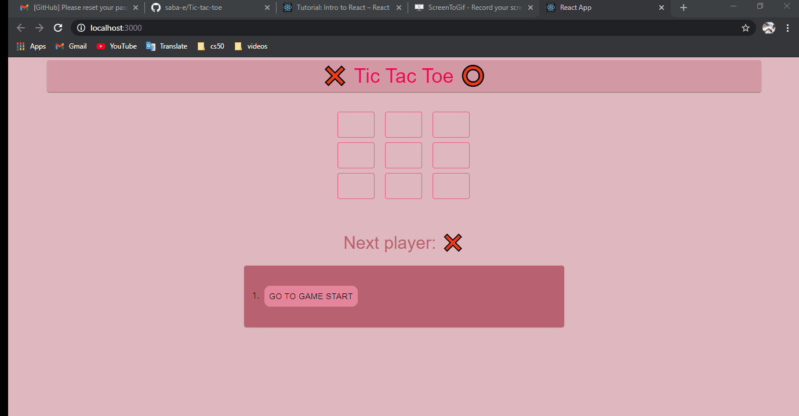

# First React App with Material UI

This is the 3rd Excersice of IE class. Those part of codes which contain Logic parts of Tic Toc Toe game are from [here](https://reactjs.org/tutorial/tutorial.html)
  and the UI part is based on Material UI Docs.
  
  
   
  

